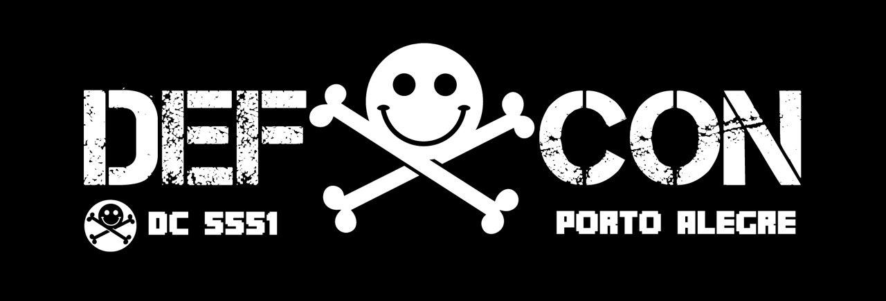

# DEF CON 5551 2019

## 1º Capture The Flag - DEF CON 5551

Bem vindos à primeira edição do campeonato de _Capture the Flag_ (CTF) organizado pela DEF CON 5551.

Neste CTF você irá encontrar desafios _Boot to Root_ onde seu objetivo é obter acesso privilegiado (root) em cada um dos servidores. Após o término do CTF, serão disponibilizados os arquivos e write ups de todos os desafios aqui contidos.

### Regras

Ao participar deste campeonato de _Capture the Flag_, você automaticamente concorda com as regras descritas abaixo. O membro que não respeitar qualquer uma das regras será desclassificado do campeonato.

1. É proibido qualquer tentativa de ataque contra a infraestrutura do evento assim como contra outros participantes deste campeonato.
2. A participação deste CTF é invididual. Portanto, não é permitido solicitar auxílio de outros membros, participantes e organizadores do evento.
3. O campeonato terá duração de 8 horas, sem intervalo, com início às 09:00 horas do dia 30/11/2019 e encerramento às 17:00 do mesmo dia.
4. Após o término do campeonato, o participante com o maior número de pontos vence. Em caso de empate, serão utilizados os critérios de desempate, em ordem, descritos abaixo.
    1. Nível no HackTheBox.
    2. Número de badges no HackTheBox.
    3. Número de root e user flags no HackTheBox.
5. Não é permitido deixar o espaço do evento durante a realização do CTF.
6. É proibido o consumo de bebidas alcóolicas, cigarros e substâncias ilícitas nas premissas da Unisinos.
7. Siga todas as demais regras e normas estabelecidas pela Unisinos.

### Premiação

#### Primeiro Colocado

Estadia em hotel + 1 (um) ingresso para a H2HC 2020 em São Paulo.

#### Segundo Colocado

1 (um) USB HID-Injector.

A equipe da DEF CON 5551 deseja a todos um ótimo evento.